# SmartCopy

**High-Performance, Intelligent File Copy Utility for HPC Environments**

[](https://www.rust-lang.org)
[](LICENSE)

SmartCopy is a blazingly fast, intelligent file copy utility designed for High-Performance Computing (HPC) environments. Built in Rust for maximum performance, memory safety, and zero-cost abstractions.

## Features

### Core Capabilities

- **Multi-threaded Parallel Copying**: Work-stealing thread pool using Rayon for optimal load balancing
- **Intelligent Resource Detection**: Auto-detect CPU cores, memory, storage type (NVMe/SSD/HDD/NFS)
- **Smart File Ordering**: Copy smallest files first for quick wins, or customize ordering strategy
- **Chunked Large File Transfer**: Parallel 64MB chunk processing for huge files (≥1GB) - up to **6+ GB/s**
- **Parallel Hash Verification**: Compute checksums in parallel with copy - maintains 6+ GB/s even with `--verify`
- **Zero-Copy I/O**: Memory-mapped files and `copy_file_range()` for maximum throughput
- **io_uring Support** (Linux 5.1+): Async I/O with automatic kernel version detection for ~20% throughput boost
- **Direct I/O**: Bypass page cache for huge files, preventing cache pollution
- **Adaptive Buffer Sizing**: Automatic buffer optimization based on file size and storage type

### Integrity & Synchronization

- **Multiple Hash Algorithms**:
  - XXHash3 (128-bit, ultra-fast ~20 GB/s)
  - XXHash64 (64-bit, fast)
  - BLAKE3 (256-bit, fast + cryptographic)
  - SHA-256 (cryptographic standard)
- **Streaming Verification**: Single-pass copy-and-hash for efficiency
- **Incremental Sync**: Only copy new or changed files based on mtime/size
- **Delta Transfer**: rsync-like rolling checksum for block-level change detection
- **Manifest Tracking**: JSON/binary persistent state for efficient re-sync

### Network Transfer

- **SSH/SFTP**: Secure remote transfers with parallel streams
- **SSH Tuning**: ControlMaster multiplexing, fast ciphers (chacha20-poly1305, aes128-gcm)
- **Remote Agent**: rsync-like remote agent for delta sync over SSH pipe
- **QUIC Transport**: HTTP/3-like protocol with 0-RTT, multiplexing, and modern congestion control
- **Direct TCP**: Maximum throughput mode for trusted LANs
- **LZ4 Compression**: Ultra-fast on-the-fly compression (<1 GB/s overhead)
- **Bandwidth Limiting**: Optional rate limiting for shared networks
- **SMB Multichannel**: Automatic detection and optimization for SMB3 shares
- **NFS Optimization**: Parallel NFS (pNFS) aware with optimized buffer sizes

### System Optimization

- **NUMA Awareness**: Thread pinning to memory nodes for multi-socket systems with automatic topology detection
- **Tuning Recommendations**: Kernel, network, and storage parameter suggestions
- **Storage Type Detection**: Automatic optimization for NVMe, SSD, HDD, NFS, SMB/CIFS
- **Memory Management**: Efficient buffer pooling and reuse
- **Adaptive I/O**: Automatically selects best copy method based on filesystem type
- **Bandwidth Throttling**: Rate limiting with token-bucket algorithm for shared networks
- **Extended Attributes**: Full xattr/ACL preservation on Unix systems

### File Handling

- **Unicode Support**: Full UTF-8 filenames including CJK, Cyrillic, Arabic
- **Emoji Support**: Handles emoji characters in filenames (📁, 🚀, 🎵)
- **Non-UTF8 Paths**: Preserves raw bytes via hex encoding in manifest
- **Pattern Filtering**: Include/exclude files with glob patterns
- **Size Filtering**: Min/max file size limits

## Installation

### From Source

```bash
# Clone the repository
git clone https://github.com/gustcol/smartcopy/smartcopy.git
cd smartcopy

# Build release version
cargo build --release

# Install globally
cargo install --path .
```

### Requirements

- Rust 1.70 or later
- Linux, macOS, or Windows

### Optional Features

SmartCopy uses Cargo features to enable optional functionality. This keeps the default binary small and fast.

```bash
# Default build (SSH + compression)
cargo build --release

# Build with all features
cargo build --release --all-features

# Build with specific features
cargo build --release --features "encryption,numa,quic"
```

| Feature | Description | Dependencies | Default |
|---------|-------------|--------------|---------|
| `ssh` | SSH/SFTP remote transfers | ssh2 | ✅ Yes |
| `compression` | LZ4 compression | lz4_flex | ✅ Yes |
| `encryption` | File encryption (AES, ChaCha20) | aes-gcm, chacha20poly1305, argon2 | ❌ No |
| `numa` | NUMA topology awareness | hwloc2 | ❌ No |
| `quic` | QUIC/HTTP3 transport | quinn, rustls | ❌ No |
| `io_uring` | Linux io_uring async I/O | io-uring | ❌ No |

**Feature Combinations:**

```bash
# HPC cluster with encryption
cargo build --release --features "encryption,numa"

# High-speed network transfers
cargo build --release --features "quic,compression"

# Maximum performance on Linux
cargo build --release --features "io_uring,numa"
```

## Quick Start

### Basic Copy

```bash
# Copy a directory
smartcopy /source/path /destination/path

# Copy with progress display
smartcopy /source /dest --progress

# Copy with verification
smartcopy /source /dest --verify blake3
```

### Advanced Usage

```bash
# High-performance parallel copy with 16 threads
smartcopy /source /dest --threads 16 --buffer-size 4M

# Incremental sync (only copy changed files)
smartcopy /source /dest --incremental

# Full sync with extra file deletion
smartcopy /source /dest --incremental --delete-extra

# Copy with compression (for network transfers)
smartcopy /local/path user@server:/remote/path --ssh --compress

# Dry run (show what would be copied)
smartcopy /source /dest --dry-run
```

### System Analysis

```bash
# Analyze system resources
smartcopy analyze --detailed

# Get tuning recommendations for your workload
smartcopy tuning --workload large-files
smartcopy tuning --workload small-files
smartcopy tuning --workload network
```

### Verification

```bash
# Verify a previous copy
smartcopy verify /source /dest --algorithm blake3

# Check manifest status
smartcopy status /path/to/manifest.json
```

### Benchmarking

```bash
# Run performance benchmark
smartcopy benchmark /tmp/benchmark --size 1G
```

## Usage Scenarios & Flowcharts

### Scenario 1: Daily Backup with Verification

**Use Case**: Backup important data nightly with integrity verification.


**Commands:**

```bash
# Initial full backup with verification
smartcopy /data /backup --verify blake3 --progress

# Subsequent incremental backups (only changed files)
smartcopy /data /backup --incremental --verify blake3

# Schedule via cron (nightly at 2 AM)
# crontab -e
0 2 * * * /usr/local/bin/smartcopy /data /backup --incremental --verify blake3 --quiet
```

### Scenario 2: HPC Data Migration

**Use Case**: Move terabytes of simulation data between HPC clusters.


**Commands:**

```bash
# On destination node: Start agent
smartcopy agent --protocol tcp --port 9878 --bind 0.0.0.0

# On source node: Parallel transfer with 32 threads
smartcopy /scratch/simulation user@nodeB:/scratch/simulation \
    --threads 32 \
    --buffer-size 64M \
    --tcp-agent \
    --compress \
    --progress

# Submit as Slurm job for large transfers
smartcopy submit --scheduler slurm \
    --nodes 1 \
    --cpus 32 \
    --memory 64G \
    --time 4:00:00 \
    /scratch/input /scratch/output
```

### Scenario 3: Encrypted Cloud Backup

**Use Case**: Backup sensitive data to S3 with encryption.


**Commands:**

```bash
# Build with encryption support
cargo build --release --features encryption

# Generate encryption key (store securely!)
smartcopy keygen --output ~/.smartcopy/backup.key --algorithm aes256

# Encrypt and upload to S3
smartcopy /sensitive/data s3://my-bucket/backups/ \
    --encrypt \
    --key-file ~/.smartcopy/backup.key \
    --compress \
    --verify blake3

# Download and decrypt
smartcopy s3://my-bucket/backups/ /restored/data/ \
    --decrypt \
    --key-file ~/.smartcopy/backup.key
```

### Scenario 4: Real-time Sync with Bandwidth Limits

**Use Case**: Sync data to remote server during business hours with bandwidth limits.


**Commands:**

```bash
# Create schedule configuration
cat > /etc/smartcopy/schedule.json << 'EOF'
{
  "rules": [
    {"name": "Business", "days": ["Mon","Tue","Wed","Thu","Fri"],
     "start": "09:00", "end": "18:00", "limit_mbps": 100},
    {"name": "Evening", "days": null,
     "start": "18:00", "end": "22:00", "limit_mbps": 500},
    {"name": "Night", "days": null,
     "start": "22:00", "end": "06:00", "limit_mbps": 0}
  ],
  "default_limit_mbps": 200
}
EOF

# Run sync with schedule
smartcopy /data user@server:/backup \
    --ssh \
    --incremental \
    --schedule-file /etc/smartcopy/schedule.json \
    --resume

# Force full speed (ignore schedule)
smartcopy /data user@server:/backup --ignore-schedule
```

### Scenario 5: Large File Delta Sync

**Use Case**: Sync large database files where only portions change.

```mermaid
flowchart TD
    subgraph DELTA["DELTA SYNC FLOW"]
        A["Original File (10 GB)<br>████████████████████████████████████"] --> B["Modified File (10 GB)<br>████████░░░░████████████████████████<br>Changed blocks ~500 MB"]
        B --> C["Delta Transfer<br>~500 MB instead of 10 GB<br>95% bandwidth savings!"]
    end
```



**Commands:**

```bash
# Initial sync (full transfer)
smartcopy /data/database.db user@server:/backup/database.db --ssh

# Subsequent syncs use delta transfer (rsync-like)
smartcopy /data/database.db user@server:/backup/database.db \
    --ssh \
    --delta \
    --use-agent \
    --progress

# For very large files, use chunked transfer
smartcopy /data/huge-file.bin /backup/huge-file.bin \
    --delta \
    --chunk-size 64M \
    --threads 8
```

### Scenario 6: Multi-Node Cluster Deployment

**Use Case**: Deploy software to all nodes in an HPC cluster.


**Commands:**

```bash
# Using Ansible for deployment (see deploy/ansible/)
cd deploy/ansible
ansible-playbook -i inventory.yml playbook.yml

# Or manual parallel deployment
for node in node{01..10}.cluster; do
    smartcopy /opt/software $node:/opt/software \
        --ssh \
        --incremental \
        --compress &
done
wait

# Using QUIC for faster transfers within cluster
# On each node:
smartcopy quic-server --port 4433 &

# From master:
for node in node{01..10}.cluster; do
    smartcopy /opt/software quic://$node:4433/opt/software &
done
wait
```

### Decision Flowchart: Choosing the Right Transfer Method


## CLI Reference

```
USAGE:
    smartcopy [OPTIONS] <SOURCE> <DESTINATION>
    smartcopy <COMMAND>

COMMANDS:
    analyze     Analyze system resources and capabilities
    tuning      Show tuning recommendations
    highspeed   High-speed network guide (10g, 100g, 200g, 400g)
    verify      Verify integrity of a previous copy
    status      Show manifest/sync status
    server      Run as TCP server for direct transfers
    agent       Start remote agent (for SSH pipe or TCP)
    quic-server Run QUIC/HTTP3 server for high-performance transfers
    api-server  Start REST API server for dashboard integration
    benchmark   Run performance benchmarks
    help        Print help information

OPTIONS:
    -t, --threads <NUM>         Number of parallel threads (0 = auto-detect)
    -b, --buffer-size <SIZE>    Buffer size (e.g., 1M, 64K)
        --verify <ALGO>         Hash algorithm: xxhash3, blake3, sha256
    -i, --incremental           Enable incremental sync mode
        --delta                 Use delta transfer for large files
    -c, --compress              Enable LZ4 compression
        --ssh                   Use SSH/SFTP for remote transfers
    -p, --progress              Show detailed progress
    -v, --verbose               Verbose output
    -q, --quiet                 Quiet mode
    -n, --dry-run               Show what would be copied
        --delete-extra          Delete extra files in destination
        --include <PATTERN>     Include file pattern (glob)
        --exclude <PATTERN>     Exclude file pattern (glob)
        --max-size <SIZE>       Maximum file size to copy
        --min-size <SIZE>       Minimum file size to copy
        --bandwidth-limit <RATE> Limit bandwidth (e.g., 100M)
        --retries <NUM>         Retry failed operations
        --use-agent             Use remote agent for delta sync
        --quic                  Use QUIC transport instead of SSH
        --quic-port <PORT>      QUIC server port (default: 4433)
        --control-master        Enable SSH ControlMaster multiplexing
        --ssh-cipher <CIPHER>   SSH cipher: chacha20-poly1305, aes128-gcm, aes256-gcm
    -h, --help                  Print help
    -V, --version               Print version
```

## Advanced Remote Transfer

### SSH Tuning & ControlMaster

SmartCopy includes advanced SSH tuning for maximum remote transfer performance:

```bash
# Enable SSH ControlMaster for connection multiplexing
smartcopy /local/data user@server:/remote/path --ssh --control-master

# Use fast cipher for better throughput
smartcopy /local/data user@server:/remote/path --ssh --ssh-cipher chacha20-poly1305

# Full SSH tuning with compression
smartcopy /local/data user@server:/remote/path --ssh --control-master --ssh-cipher aes128-gcm --compress
```

**SSH Tuning Options:**

| Option | Description | Performance Impact |
|--------|-------------|-------------------|
| ControlMaster | Reuse SSH connections | Eliminates connection overhead (~500ms per connection) |
| chacha20-poly1305 | ChaCha20 cipher | Best for ARM/mobile CPUs without AES-NI |
| aes128-gcm | AES-GCM cipher | Best for modern CPUs with AES-NI (~10+ Gbps) |
| aes256-gcm | AES-256-GCM cipher | Maximum security with AES-NI hardware |
| Compression | LZ4 compression | Reduces bandwidth for compressible data |

### Remote Agent (rsync-like)

SmartCopy can spawn a remote agent over SSH for delta sync, similar to how rsync works:

```bash
# Use remote agent for delta transfer (like rsync)
smartcopy /local/data user@server:/remote/path --ssh --use-agent --incremental

# The agent enables:
# - Remote file signature calculation
# - Block-level delta sync
# - Minimal data transfer
```

**How it works:**

1. SmartCopy spawns `smartcopy agent --protocol stdio` on the remote host via SSH
2. Agent runs as a daemon, communicating via stdin/stdout (binary protocol)
3. Client requests file signatures from remote agent
4. Delta operations are computed locally
5. Only changed blocks are transferred

**Manual agent mode (for debugging or custom setups):**

```bash
# On remote server - start agent in TCP mode
smartcopy agent --protocol tcp --port 9999 --bind 0.0.0.0

# On client - connect to TCP agent
smartcopy /local/data server:9999:/remote/path --tcp-agent
```

### QUIC Transport (HTTP/3-like)

For maximum performance in controlled environments, SmartCopy supports QUIC transport:

```bash
# Start QUIC server on remote host
smartcopy quic-server --port 4433 --bind 0.0.0.0

# Copy using QUIC transport
smartcopy /local/data quic://server:4433/remote/path

# With custom certificates
smartcopy quic-server --port 4433 --cert /path/to/cert.pem --key /path/to/key.pem
```

**QUIC Benefits:**

| Feature | Description |
|---------|-------------|
| 0-RTT | Zero round-trip connection establishment |
| Multiplexing | Multiple streams without head-of-line blocking |
| Modern Congestion Control | BBR-like algorithms for high throughput |
| Built-in Encryption | TLS 1.3 by default |
| Connection Migration | Seamless failover on network changes |

**Self-signed certificates:**

When no certificate is provided, SmartCopy generates and caches self-signed certificates in `~/.smartcopy/`:

```
~/.smartcopy/
├── quic-cert.pem    # TLS certificate
└── quic-key.pem     # Private key
```

### Performance Comparison

| Protocol | Latency | Throughput | Security | Best For |
|----------|---------|------------|----------|----------|
| SSH/SFTP | High | Moderate | Excellent | Internet/WAN |
| SSH+Agent | Medium | High | Excellent | Remote delta sync |
| TCP Direct | Low | Very High | None | Trusted LAN |
| QUIC | Low | Very High | Excellent | Controlled environments |

## High-Speed Network Tuning (10G/100G/200G/400G)

SmartCopy includes comprehensive guides for high-speed network transfers. Use the `highspeed` command to get detailed recommendations:

```bash
# Get tuning guide for 10 Gbps (~1.25 GB/s)
smartcopy highspeed 10g

# Get tuning guide for 100 Gbps (~12.5 GB/s)
smartcopy highspeed 100g

# Get tuning guide for 200 Gbps (~25 GB/s)
smartcopy highspeed 200g

# Get tuning guide for 400 Gbps (~50 GB/s)
smartcopy highspeed 400g
```

### Quick Reference by Speed Tier

#### 10 Gbps (~1.25 GB/s)

```bash
# SmartCopy command
smartcopy /source /dest --threads 8 --buffer-size 16M --quic --streams 4 --progress

# Kernel tuning
sysctl -w net.core.rmem_max=67108864
sysctl -w net.core.wmem_max=67108864
sysctl -w net.ipv4.tcp_congestion_control=bbr

# Network interface
ip link set eth0 mtu 9000
ethtool -G eth0 rx 4096 tx 4096
```

**Requirements:**
- Single NVMe SSD (min 2 GB/s)
- Jumbo frames (MTU 9000)
- BBR congestion control

#### 100 Gbps (~12.5 GB/s)

```bash
# SmartCopy command
smartcopy /source /dest --threads 32 --buffer-size 64M --quic --streams 16 --progress

# Kernel tuning
sysctl -w net.core.rmem_max=536870912
sysctl -w net.core.wmem_max=536870912
sysctl -w net.core.netdev_max_backlog=250000
sysctl -w net.ipv4.tcp_congestion_control=bbr

# Network interface
ip link set eth0 mtu 9000
ethtool -G eth0 rx 16384 tx 16384
```

**Requirements:**
- Multiple NVMe SSDs in RAID-0 or parallel filesystem
- NUMA awareness critical
- IRQ affinity configuration
- io_uring enabled (Linux 5.6+)

#### 200 Gbps (~25 GB/s)

```bash
# SmartCopy command
smartcopy /source /dest --threads 64 --buffer-size 128M --quic --streams 32 --progress

# Kernel tuning
sysctl -w net.core.rmem_max=1073741824
sysctl -w net.core.wmem_max=1073741824
sysctl -w net.core.netdev_max_backlog=500000
sysctl -w net.core.optmem_max=134217728
```

**Requirements:**
- Multiple 100G NICs or bonded connection
- Enterprise NVMe array or Lustre/GPFS
- RDMA (RoCE v2) recommended
- Kernel bypass may be needed

#### 400 Gbps (~50 GB/s)

```bash
# SmartCopy command
smartcopy /source /dest --threads 128 --buffer-size 256M --quic --streams 64 --progress

# Kernel tuning
sysctl -w net.core.rmem_max=2147483647
sysctl -w net.core.wmem_max=2147483647
sysctl -w net.core.netdev_max_backlog=1000000
sysctl -w net.core.optmem_max=268435456
```

**Requirements:**
- Specialized 400G NICs (Mellanox ConnectX-7+)
- Multiple NICs across NUMA nodes
- High-performance parallel filesystem
- RDMA/InfiniBand strongly recommended
- Custom network stack (DPDK, XDP, io_uring)
- Real-world throughput: 70-80% of line rate

### System Requirements Summary

| Speed | Threads | Buffer | Streams | NICs | Storage | Special |
|-------|---------|--------|---------|------|---------|---------|
| 10G | 8 | 16MB | 4 | 1 | NVMe | MTU 9000 |
| 100G | 32 | 64MB | 16 | 1 | RAID/Lustre | NUMA, IRQ affinity |
| 200G | 64 | 128MB | 32 | 2+ | Lustre/GPFS | RDMA, kernel bypass |
| 400G | 128 | 256MB | 64 | 4+ | Parallel FS | RDMA, DPDK/XDP |

### Persistent Kernel Configuration

Create `/etc/sysctl.d/99-smartcopy.conf`:

```bash
# For 100G network - adjust values for your speed tier
net.core.rmem_max=536870912
net.core.wmem_max=536870912
net.ipv4.tcp_rmem=4096 87380 536870912
net.ipv4.tcp_wmem=4096 65536 536870912
net.core.netdev_max_backlog=250000
net.core.netdev_budget=600
net.ipv4.tcp_congestion_control=bbr
net.ipv4.tcp_mtu_probing=1
net.ipv4.tcp_timestamps=1
net.ipv4.tcp_sack=1
net.core.somaxconn=65535

# Apply with:
sudo sysctl --system
```

### Verification Commands

```bash
# Check MTU
ip link show eth0 | grep mtu

# Check TCP buffers
sysctl net.core.rmem_max net.core.wmem_max

# Check congestion control
sysctl net.ipv4.tcp_congestion_control

# Check ring buffer
ethtool -g eth0

# Test with iperf3
iperf3 -c <server> -P 16 -t 60  # 16 parallel streams for 60 seconds
```

## Agent Installation & Deployment

SmartCopy includes a remote agent for high-performance delta sync operations (similar to how rsync works). The agent can be deployed manually, via shell script, or using Ansible for multi-host deployments.

### Quick Installation (Single Host)

```bash
# One-liner installation with default settings (10G network)
curl -sSL https://raw.githubusercontent.com/smartcopy/smartcopy/main/deploy/install.sh | sudo bash

# Install for 100G network with QUIC support
curl -sSL https://raw.githubusercontent.com/smartcopy/smartcopy/main/deploy/install.sh | sudo bash -s -- --speed 100g --quic

# Custom options
sudo ./deploy/install.sh --speed 100g --agent-port 9878 --quic --quic-port 9877
```

**Installation Options:**
| Option | Description | Default |
|--------|-------------|---------|
| `--speed` | Network tier: 10g, 100g, 200g, 400g | 10g |
| `--agent-port` | TCP port for agent | 9878 |
| `--quic` | Enable QUIC server | disabled |
| `--quic-port` | QUIC server port | 9877 |
| `--no-service` | Don't create systemd service | enabled |
| `--no-tuning` | Don't apply kernel tuning | enabled |
| `--from-source` | Build from source | binary |

### Manual Installation

#### Prerequisites

**Ubuntu/Debian:**
```bash
sudo apt update
sudo apt install -y curl ca-certificates build-essential pkg-config libssl-dev ethtool git
```

**RHEL/CentOS/Rocky:**
```bash
sudo yum install -y curl ca-certificates gcc gcc-c++ make openssl-devel pkgconfig ethtool git
```

#### Build from Source

```bash
# Install Rust
curl --proto '=https' --tlsv1.2 -sSf https://sh.rustup.rs | sh -s -- -y
source $HOME/.cargo/env

# Clone and build
git clone https://github.com/smartcopy/smartcopy.git
cd smartcopy
cargo build --release

# Install
sudo cp target/release/smartcopy /usr/local/bin/
```

#### Create User and Directories

```bash
sudo groupadd --system smartcopy
sudo useradd --system --gid smartcopy --shell /sbin/nologin smartcopy

sudo mkdir -p /etc/smartcopy /var/lib/smartcopy /var/log/smartcopy
sudo chown -R smartcopy:smartcopy /var/lib/smartcopy /var/log/smartcopy
```

#### Create Systemd Service

```bash
sudo tee /etc/systemd/system/smartcopy-agent.service << 'EOF'
[Unit]
Description=SmartCopy Agent
After=network-online.target
Wants=network-online.target

[Service]
Type=simple
User=smartcopy
Group=smartcopy
ExecStart=/usr/local/bin/smartcopy agent --protocol tcp --port 9878 --bind 0.0.0.0
Restart=always
RestartSec=5
LimitNOFILE=1048576
Nice=-10

[Install]
WantedBy=multi-user.target
EOF

sudo systemctl daemon-reload
sudo systemctl enable smartcopy-agent
sudo systemctl start smartcopy-agent
```

#### Configure Firewall

```bash
# Ubuntu/Debian (ufw)
sudo ufw allow 9878/tcp
sudo ufw allow 9877/udp  # For QUIC

# RHEL/CentOS (firewalld)
sudo firewall-cmd --permanent --add-port=9878/tcp
sudo firewall-cmd --permanent --add-port=9877/udp
sudo firewall-cmd --reload
```

### Ansible Deployment (Multi-Host)

For deploying SmartCopy agents across multiple hosts, use the included Ansible playbook:

```bash
cd deploy/ansible

# Copy and edit inventory
cp inventory.example.yml inventory.yml
vim inventory.yml
```

**Example Inventory:**
```yaml
all:
  vars:
    smartcopy_network_speed: "100g"
    smartcopy_apply_kernel_tuning: true
    smartcopy_quic_enabled: true

  children:
    smartcopy_agents:
      hosts:
        node1.example.com:
          ansible_host: 192.168.1.10
        node2.example.com:
          ansible_host: 192.168.1.11
          smartcopy_network_speed: "10g"
```

**Run Playbook:**
```bash
# Full installation
ansible-playbook -i inventory.yml playbook.yml

# Dry run
ansible-playbook -i inventory.yml playbook.yml --check

# Only kernel tuning
ansible-playbook -i inventory.yml playbook.yml --tags tuning

# Only services
ansible-playbook -i inventory.yml playbook.yml --tags service
```

**Available Tags:**
| Tag | Description |
|-----|-------------|
| `install` | Install SmartCopy binary |
| `configure` | Create configuration files |
| `tuning` | Apply kernel tuning |
| `service` | Manage systemd services |
| `quic` | Configure QUIC server |

### Using the Agent

#### TCP Agent Mode (Standalone Daemon)

```bash
# On remote host - agent runs as daemon
smartcopy agent --protocol tcp --port 9878 --bind 0.0.0.0

# From client - connect to TCP agent
smartcopy /local/data host:9878:/remote/path --tcp-agent --incremental
```

#### SSH STDIO Mode (Automatic)

```bash
# Client spawns agent automatically via SSH
smartcopy /local/data user@host:/remote/path --ssh --use-agent --incremental

# The client runs this on remote:
# ssh user@host "smartcopy agent --protocol stdio"
```

### Verification

```bash
# Check service status
sudo systemctl status smartcopy-agent
sudo journalctl -u smartcopy-agent -f

# Test agent connection
nc -zv agent-host 9878

# Check kernel tuning
sysctl net.core.rmem_max net.core.wmem_max

# Run performance test
iperf3 -c agent-host -P 16 -t 60
```

### Troubleshooting

| Issue | Solution |
|-------|----------|
| Connection refused | Check firewall: `iptables -L -n \| grep 9878` |
| Agent won't start | Check logs: `journalctl -u smartcopy-agent -n 50` |
| Poor performance | Verify tuning: `smartcopy highspeed 100g` |
| QUIC issues | Check UDP port: `ss -ulnp \| grep 9877` |

For detailed deployment documentation, see [deploy/README.md](deploy/README.md).

## API Server

SmartCopy includes a REST API server for programmatic access and dashboard integration:

```bash
# Start API server
smartcopy api-server --port 8080 --bind 0.0.0.0

# With API key authentication
smartcopy api-server --port 8080 --api-key YOUR_SECRET_KEY

# With history persistence
smartcopy api-server --port 8080 --history /var/lib/smartcopy/history.json
```

### API Endpoints

| Endpoint | Method | Description |
|----------|--------|-------------|
| `/api/status` | GET | System status and health |
| `/api/jobs` | GET | List active transfer jobs |
| `/api/jobs/{id}` | GET | Get job details |
| `/api/jobs` | POST | Create new transfer job |
| `/api/jobs/{id}` | DELETE | Cancel job |
| `/api/history` | GET | Transfer history |
| `/api/history/stats` | GET | Aggregate statistics |
| `/api/compare` | GET | Compare transfers |
| `/api/agents` | GET | Connected agents |
| `/api/system` | GET | System information |
| `/api/metrics` | GET | Prometheus metrics |

### Example Usage

```bash
# Get system status
curl http://localhost:8080/api/status

# List active jobs
curl http://localhost:8080/api/jobs

# Create a new transfer job
curl -X POST http://localhost:8080/api/jobs \
  -H "Content-Type: application/json" \
  -d '{"source": "/data/input", "destination": "/data/output", "verify": true}'

# Get transfer history
curl http://localhost:8080/api/history?limit=50

# Compare transfers
curl "http://localhost:8080/api/compare?ids=job1,job2,job3"

# Get Prometheus metrics
curl http://localhost:8080/api/metrics
```

## Monitoring Dashboard

SmartCopy provides a React-based monitoring dashboard for **large-scale HPC environments**. The dashboard is designed for:

- Large HPC clusters with hundreds of nodes
- Enterprise data centers with petabyte-scale transfers
- Multi-tenant environments requiring audit trails
- Operations teams needing real-time visibility

> **Note**: For small-scale or single-user environments, the SmartCopy CLI provides sufficient functionality without additional overhead.

### Architecture


**Important**: SmartCopy itself runs natively on the host for maximum I/O performance. Only the dashboard runs in Docker.

### Dashboard Features

- **Real-time Monitoring**: Active transfer jobs with progress bars, throughput metrics, and ETA
- **Transfer History**: Complete history with aggregate statistics (7/30/90 days)
- **Performance Comparison**: Compare multiple transfers side-by-side with trend analysis
- **Anomaly Detection**: Automatic detection of throughput drops, spikes, and high failure rates
- **System Information**: CPU, memory, storage details, io_uring and NUMA support status
- **Prometheus Metrics**: `/api/metrics` endpoint ready for Grafana integration

### Quick Start

```bash
# 1. Start SmartCopy API server (on host)
smartcopy api-server --port 8080 --bind 0.0.0.0

# 2. Start Dashboard (Docker)
cd dashboard
docker-compose up -d

# 3. Access Dashboard
open http://localhost:3000
```

For detailed dashboard documentation, see [dashboard/README.md](dashboard/README.md).

## Parallel Remote Sync

SmartCopy includes a high-performance parallel remote sync module with connection pooling for maximum throughput:

### Features

- **Connection Pooling**: Reuse connections across multiple file transfers
- **Work-Stealing Parallelism**: Rayon-based thread pool for optimal load balancing
- **Retry with Backoff**: Automatic retry with exponential backoff on failures
- **Progress Tracking**: Real-time progress updates per file and total

### Usage

```rust
use smartcopy::network::{ParallelRemoteSync, ConnectionPool};

// Create connection pool
let pool = ConnectionPool::new(8); // 8 connections

// Initialize parallel sync
let sync = ParallelRemoteSync::new(pool)
    .with_threads(16)
    .with_retries(3);

// Sync files
let results = sync.sync_files(&files, |progress| {
    println!("Progress: {}/{}", progress.completed, progress.total);
})?;
```

### Performance

| Connections | Threads | Files/sec | Throughput |
|-------------|---------|-----------|------------|
| 1 | 1 | ~50 | ~500 MB/s |
| 4 | 8 | ~200 | ~2 GB/s |
| 8 | 16 | ~400 | ~4 GB/s |
| 16 | 32 | ~600 | ~6 GB/s |

## Sparse File Support

SmartCopy automatically detects and preserves sparse files (files with holes):

```bash
# Copy preserving sparse regions
smartcopy /data/sparse-file.img /backup/ --sparse

# Analyze sparse file
smartcopy analyze --sparse /data/large-disk.img
```

**Benefits:**
- Significant disk space savings for disk images, VM files, databases
- Faster copies (only non-zero regions are transferred)
- Automatic detection on Unix (via `stat` blocks) and Windows (via FSCTL_QUERY_ALLOCATED_RANGES)

| File Type | Typical Sparse Ratio | Space Saved |
|-----------|---------------------|-------------|
| VM disk images | 30-80% | Huge |
| Database files | 10-50% | Significant |
| Log files | 5-20% | Moderate |

## Resume Interrupted Transfers

SmartCopy can resume transfers that were interrupted:

```bash
# Start a transfer with resume support
smartcopy /large/dataset /backup --resume

# The transfer creates checkpoints in ~/.smartcopy/transfers/
# If interrupted, simply run the same command again to resume

# List pending transfers
smartcopy transfers --list

# Resume a specific transfer
smartcopy transfers --resume <transfer-id>

# Clean up old transfer state
smartcopy transfers --cleanup --max-age 7d
```

**Features:**
- Automatic checkpointing every 64MB (configurable)
- Per-file progress tracking
- Partial file verification before resume
- State persisted to JSON for debugging

## Bandwidth Scheduling

SmartCopy supports time-based bandwidth limits for transfers:

```bash
# Use predefined schedule (full speed at night, limited during day)
smartcopy /data /backup --schedule business-hours

# Custom schedule from file
smartcopy /data /backup --schedule-file /etc/smartcopy/schedule.json

# Override schedule temporarily
smartcopy /data /backup --bandwidth-limit 100M --ignore-schedule
```

**Example schedule.json:**
```json
{
  "rules": [
    {
      "name": "Business hours",
      "days": ["Monday", "Tuesday", "Wednesday", "Thursday", "Friday"],
      "start_time": "09:00",
      "end_time": "18:00",
      "limit": 104857600
    },
    {
      "name": "Night transfer window",
      "days": null,
      "start_time": "22:00",
      "end_time": "06:00",
      "limit": 0
    }
  ],
  "default_limit": 52428800,
  "enabled": true
}
```

**Predefined Schedules:**
- `business-hours`: Limited 9-6 weekdays, unlimited nights/weekends
- `weekend-full`: Limited weekdays, unlimited weekends
- `off-peak`: Limited 6am-10pm, unlimited overnight

## HPC Job Scheduler Integration

SmartCopy integrates with HPC job schedulers for large-scale deployments:

### Supported Schedulers
- **Slurm** (most common in HPC)
- **PBS/Torque**
- **PBS Pro**
- **IBM Spectrum LSF**
- **SGE/UGE** (Sun/Univa Grid Engine)

### Automatic Detection

```bash
# SmartCopy auto-detects scheduler from environment
smartcopy /data /scratch

# Explicitly use scheduler resources
smartcopy /data /scratch --threads $SLURM_CPUS_PER_TASK
```

### Submit as Batch Job

```bash
# Submit SmartCopy as Slurm job
smartcopy submit --scheduler slurm \
  --nodes 1 \
  --cpus 32 \
  --memory 64G \
  --time 4:00:00 \
  /data/input /scratch/output

# Submit with job array (for multiple directories)
smartcopy submit --scheduler slurm \
  --array 1-100 \
  /data/run_%a /scratch/run_%a
```

### Environment Variables Used

| Scheduler | Job ID | CPUs | Nodes | Memory |
|-----------|--------|------|-------|--------|
| Slurm | `SLURM_JOB_ID` | `SLURM_CPUS_PER_TASK` | `SLURM_NNODES` | `SLURM_MEM_PER_NODE` |
| PBS | `PBS_JOBID` | `PBS_NP` | `PBS_NUM_NODES` | - |
| LSF | `LSB_JOBID` | `LSB_DJOB_NUMPROC` | - | - |
| SGE | `JOB_ID` | `NSLOTS` | - | - |

## S3/Object Storage Support

SmartCopy supports S3-compatible object storage with optional s5cmd integration for maximum performance:

### Native S3 Support

```bash
# Upload to S3
smartcopy /local/data s3://my-bucket/path/

# Download from S3
smartcopy s3://my-bucket/path/ /local/data/

# Sync to S3
smartcopy /local/data s3://my-bucket/path/ --sync

# With custom endpoint (MinIO, Ceph, etc.)
smartcopy /local/data s3://bucket/path/ \
  --s3-endpoint http://minio.local:9000 \
  --s3-path-style
```

### s5cmd Integration (Recommended for Bulk Operations)

SmartCopy automatically detects and uses [s5cmd](https://github.com/peak/s5cmd) when available for 5-10x faster bulk transfers:

```bash
# Install s5cmd
brew install peak/tap/s5cmd  # macOS
# or download from https://github.com/peak/s5cmd/releases

# SmartCopy uses s5cmd automatically when detected
smartcopy /local/10k-files/ s3://bucket/path/

# Force specific backend
smartcopy /local/data s3://bucket/ --s3-backend s5cmd
smartcopy /local/data s3://bucket/ --s3-backend aws-cli
smartcopy /local/data s3://bucket/ --s3-backend native
```

**Performance Comparison:**

| Tool | 10,000 files (1GB) | Throughput |
|------|-------------------|------------|
| aws cli | 45s | ~20 MB/s |
| s5cmd | 8s | ~100 MB/s |
| SmartCopy + s5cmd | 7s | ~110 MB/s |

### Environment Variables

```bash
export AWS_ACCESS_KEY_ID=your_key
export AWS_SECRET_ACCESS_KEY=your_secret
export AWS_REGION=us-east-1
export S3_ENDPOINT=http://minio:9000  # Optional
```

## Encryption at Rest (Optional Module)

SmartCopy provides an **optional** encryption module for secure file encryption. This feature is not included in the default build to minimize binary size and dependencies.

### Enabling Encryption

```bash
# Build with encryption support
cargo build --release --features encryption

# Or add to default features in Cargo.toml
[features]
default = ["ssh", "compression", "encryption"]
```

### Dependencies Added by Encryption Feature

| Crate | Purpose | Size Impact |
|-------|---------|-------------|
| `aes-gcm` | AES-256-GCM encryption | ~50KB |
| `chacha20poly1305` | ChaCha20-Poly1305 encryption | ~40KB |
| `argon2` | Argon2id key derivation | ~100KB |
| `scrypt` | scrypt key derivation | ~30KB |
| `pbkdf2` | PBKDF2-SHA256 key derivation | ~20KB |
| `rand` | Secure random generation | ~50KB |

**Total impact**: ~300KB additional binary size when enabled.

### Basic Usage

```bash
# Encrypt with password
smartcopy /sensitive/data /encrypted/ --encrypt --password

# Encrypt with key file
smartcopy /sensitive/data /encrypted/ --encrypt --key-file /path/to/key

# Decrypt
smartcopy /encrypted/ /decrypted/ --decrypt --key-file /path/to/key

# Generate random key
smartcopy keygen --output /path/to/key --algorithm xchacha20
```

### Library Usage

```rust
use smartcopy::crypto::{EncryptionKey, FileEncryptor, EncryptionAlgorithm, EncryptionConfig};
use std::path::Path;

// Generate a random key
let key = EncryptionKey::generate(EncryptionAlgorithm::XChaCha20Poly1305)?;

// Or derive from password
let key = EncryptionKey::from_password(
    "my-secure-password",
    EncryptionAlgorithm::Aes256Gcm,
    &EncryptionConfig::default(),
)?;

// Encrypt a file
let encryptor = FileEncryptor::new(key);
let result = encryptor.encrypt_file(
    Path::new("/path/to/input.dat"),
    Path::new("/path/to/output.enc"),
)?;

println!("Encrypted {} bytes -> {} bytes", result.input_size, result.output_size);

// Decrypt
let result = encryptor.decrypt_file(
    Path::new("/path/to/output.enc"),
    Path::new("/path/to/decrypted.dat"),
)?;
```

### Supported Algorithms

| Algorithm | Key Size | Nonce | Performance | Best For |
|-----------|----------|-------|-------------|----------|
| AES-256-GCM | 256-bit | 96-bit | ~5 GB/s (AES-NI) | Modern Intel/AMD CPUs |
| ChaCha20-Poly1305 | 256-bit | 96-bit | ~2 GB/s | ARM, older CPUs, embedded |
| XChaCha20-Poly1305 | 256-bit | 192-bit | ~2 GB/s | Random nonces, long-lived keys |

**Algorithm Selection Guide:**
- **AES-256-GCM**: Use on servers/desktops with AES-NI (Intel 2010+, AMD 2013+)
- **ChaCha20-Poly1305**: Use on ARM devices (Raspberry Pi, Apple M1/M2) or when constant-time is critical
- **XChaCha20-Poly1305**: Use when generating random nonces (safer, no nonce reuse risk)

### Key Derivation Functions (KDF)

For password-based encryption, SmartCopy supports multiple KDFs:

| KDF | Memory | Time | Best For |
|-----|--------|------|----------|
| **Argon2id** (default) | 64MB | ~1s | General use, GPU-resistant |
| PBKDF2-SHA256 | Low | ~0.5s | FIPS compliance, compatibility |
| scrypt | 32MB | ~1s | Legacy systems, Bitcoin wallets |

```bash
# Configure Argon2id (recommended)
smartcopy /data /encrypted/ --encrypt --password \
  --kdf argon2id \
  --kdf-memory 64M \
  --kdf-time 3 \
  --kdf-parallelism 4

# Configure PBKDF2 (NIST compliant)
smartcopy /data /encrypted/ --encrypt --password \
  --kdf pbkdf2 \
  --kdf-iterations 600000

# Configure scrypt
smartcopy /data /encrypted/ --encrypt --password \
  --kdf scrypt \
  --kdf-n 20 \
  --kdf-r 8 \
  --kdf-p 1
```

### Encrypted File Format

SmartCopy uses a simple, documented file format:


### Security Considerations

1. **Key Storage**: Never store encryption keys alongside encrypted data
2. **Password Strength**: Use 16+ character passwords with Argon2id
3. **Nonce Management**: SmartCopy handles nonce generation automatically
4. **Memory Safety**: All keys are zeroized when dropped (via `zeroize` crate)
5. **Side Channels**: ChaCha20 variants provide constant-time operations

### Conditional Compilation

When building without encryption:

```rust
#[cfg(feature = "encryption")]
use smartcopy::crypto::FileEncryptor;

#[cfg(not(feature = "encryption"))]
fn encrypt_file(_: &Path, _: &Path) -> Result<()> {
    Err(SmartCopyError::FeatureDisabled("encryption"))
}
```

### Performance Benchmarks

| Algorithm | Encryption | Decryption | With Verification |
|-----------|------------|------------|-------------------|
| AES-256-GCM | 4.8 GB/s | 5.2 GB/s | 3.1 GB/s |
| ChaCha20-Poly1305 | 1.9 GB/s | 2.1 GB/s | 1.4 GB/s |
| XChaCha20-Poly1305 | 1.8 GB/s | 2.0 GB/s | 1.3 GB/s |

*Benchmarks on Apple M2 Max, single-threaded. Multi-threaded can achieve 2-3x these speeds.*

## Windows ACL Support

SmartCopy preserves Windows Access Control Lists during copies:

```bash
# Copy preserving ACLs
smartcopy C:\Data D:\Backup --preserve-acl

# Copy owner and permissions
smartcopy C:\Data D:\Backup --preserve-acl --preserve-owner

# View ACLs
smartcopy acl --show C:\Data\file.txt
```

### Preserved Attributes

- Owner SID
- Group SID
- Discretionary ACL (DACL)
- System ACL (SACL, requires SeSecurityPrivilege)
- Inherited permissions
- Explicit permissions

**Note:** Requires appropriate privileges (typically Administrator) to preserve full security descriptors.

## Library Usage

SmartCopy can be used as a Rust library:

```rust
use smartcopy::prelude::*;
use std::path::PathBuf;

fn main() -> Result<()> {
    // Simple copy
    let result = simple_copy(
        Path::new("/source"),
        Path::new("/destination")
    )?;

    println!("Copied {} files", result.files_copied);

    // Advanced configuration
    let config = CopyConfig {
        source: PathBuf::from("/source"),
        destination: PathBuf::from("/destination"),
        threads: 8,
        verify: Some(HashAlgorithm::XXHash3),
        incremental: true,
        ordering: OrderingStrategy::SmallestFirst,
        ..Default::default()
    };

    let engine = CopyEngine::new(config);
    let result = engine.execute()?;

    result.print_summary();
    Ok(())
}
```

## Performance Optimizations

SmartCopy uses multiple optimization techniques:

### I/O Optimization

| Technique | Description |
|-----------|-------------|
| Memory Mapping | Zero-copy for large files using `mmap` |
| Zero-Copy | `copy_file_range()` on Linux for kernel-level copying |
| Direct I/O | Bypass page cache for huge files |
| Vectored I/O | Multiple buffers in single syscall |
| Preallocating | Reserve destination file space upfront |

### Parallelism

| Technique | Description |
|-----------|-------------|
| Work-Stealing | Rayon thread pool for load balancing |
| Chunked Transfer | Parallel chunks for huge files |
| Parallel Scanning | Multi-threaded directory traversal |
| NUMA Awareness | Pin threads to memory nodes |

### Network

| Technique | Description |
|-----------|-------------|
| Parallel Streams | Multiple SSH/TCP connections |
| LZ4 Compression | Ultra-fast compression (<1GB/s overhead) |
| Pipelining | Overlap I/O and network transfer |

### Network Filesystem Optimization

SmartCopy automatically detects and optimizes for network filesystems:

| Filesystem | Detection | Optimization |
|------------|-----------|--------------|
| **SMB/CIFS** | Auto-detect via mount type | 4MB buffers, 8 parallel streams (multichannel) |
| **NFS** | Auto-detect via mount type | 1MB buffers matching rsize/wsize, parallel streams |
| **GPFS** | Auto-detect | Large buffers, parallel I/O |
| **Lustre** | Auto-detect | Stripe-aware, parallel I/O |
| **GlusterFS** | Auto-detect | Distributed-aware buffering |
| **CephFS** | Auto-detect | Object-aligned I/O |
| **BeeGFS** | Auto-detect | Parallel metadata operations |

#### SMB Multichannel Support

When copying to/from SMB3 shares, SmartCopy automatically:
- Detects SMB multichannel capability
- Uses 4MB buffer sizes (matching SMB max read/write)
- Opens up to 8 parallel streams per connection
- Disables memory mapping (inefficient over network)
- Optimizes for high-latency links

```bash
# Copying to SMB share - multichannel auto-enabled
smartcopy /local/data /mnt/smb_share/backup

# Force network optimization
smartcopy /local/data /mnt/nfs_share --network-optimized
```

## System Tuning Recommendations

SmartCopy can analyze your system and suggest optimizations:

```bash
$ smartcopy tuning --workload mixed

=== Tuning Recommendations for Mixed Workload ===

## Network ##

[!!] Increase TCP receive buffer
   Current: 212992
   Recommended: 67108864
   Implementation:
     $ sysctl -w net.core.rmem_max=67108864

[!] Use BBR congestion control
   Current: cubic
   Recommended: bbr
   Implementation:
     $ modprobe tcp_bbr
     $ sysctl -w net.ipv4.tcp_congestion_control=bbr

## Storage ##

[!] Optimize dirty page ratio
   Current: 20
   Recommended: 20
   Implementation:
     $ sysctl -w vm.dirty_ratio=20

## Application ##

[i] Recommended thread count
   Recommended: 8
   Implementation:
     $ smartcopy --threads 8
```

## Architecture

```
smartcopy/
├── src/
│   ├── main.rs           # CLI entry point
│   ├── lib.rs            # Library exports
│   ├── config/           # Configuration & CLI parsing
│   ├── core/             # Copy engine & scheduler
│   ├── crypto/           # Encryption at rest
│   │   └── encryption.rs # AES-GCM, ChaCha20-Poly1305
│   ├── fs/               # File operations & scanning
│   │   ├── scanner.rs    # Directory scanning
│   │   ├── operations.rs # File I/O operations
│   │   ├── sparse.rs     # Sparse file support
│   │   ├── scheduler.rs  # Bandwidth scheduling
│   │   ├── acl.rs        # Windows ACL support
│   │   ├── uring.rs      # io_uring async I/O
│   │   ├── throttle.rs   # Bandwidth limiting
│   │   └── compress.rs   # LZ4 compression
│   ├── hash/             # Integrity verification
│   ├── network/          # SSH, TCP, QUIC transfers
│   │   ├── ssh.rs        # SSH/SFTP with parallel streams
│   │   ├── tcp.rs        # Direct TCP transfers
│   │   ├── quic.rs       # QUIC/HTTP3 transport
│   │   ├── agent.rs      # Remote agent protocol
│   │   └── parallel_sync.rs  # Connection pool & parallel sync
│   ├── storage/          # Object storage
│   │   ├── s3.rs         # S3-compatible storage
│   │   └── s5cmd.rs      # s5cmd high-performance integration
│   ├── sync/             # Incremental & delta sync
│   │   ├── incremental.rs # Metadata-based sync
│   │   ├── delta.rs      # Block-level delta transfer
│   │   ├── manifest.rs   # State persistence
│   │   └── resume.rs     # Resume interrupted transfers
│   ├── system/           # Resource detection & tuning
│   │   ├── resources.rs  # System resource detection
│   │   ├── tuning.rs     # Performance recommendations
│   │   ├── numa.rs       # NUMA topology & affinity
│   │   └── hpc.rs        # Slurm/PBS/LSF integration
│   ├── progress/         # Progress reporting
│   └── api/              # REST API server
│       ├── server.rs     # HTTP server with Tokio
│       ├── handlers.rs   # Request handlers
│       ├── models.rs     # API data structures
│       └── history.rs    # Transfer history & analytics
├── dashboard/            # React monitoring dashboard
│   ├── src/
│   │   ├── pages/        # Dashboard pages
│   │   ├── components/   # React components
│   │   ├── hooks/        # Custom React hooks
│   │   └── services/     # API client
│   ├── Dockerfile        # Multi-stage Docker build
│   ├── nginx.conf        # Reverse proxy config
│   └── docker-compose.yml
└── deploy/               # Deployment scripts & Ansible
```

## Benchmarks

### Test Environment

- **CPU**: Apple M2 Max (12 cores)
- **Memory**: 96 GB
- **Storage**: NVMe SSD
- **OS**: macOS (Darwin 24.6.0)

### Comparison: SmartCopy vs rsync vs prsync vs parallel+rsync

#### Test Dataset: Mixed Workload (1.6 GB total)
- 1,000 small files (1 KB each) = 1 MB
- 100 medium files (1 MB each) = 100 MB
- 10 large files (50 MB each) = 500 MB
- 1 huge file (1 GB)

| Tool | Time | Throughput | Speedup |
|------|------|------------|---------|
| `rsync -a` | 2.07s | 772 MB/s | 1.0x |
| `rsync -aW` | 2.03s | 787 MB/s | 1.0x |
| `prsync` (parallel rsync wrapper) | 3.23s | 495 MB/s | 0.6x |
| `parallel -j12 rsync` | 5.45s | 293 MB/s | 0.4x |
| **SmartCopy** | **0.37s** | **4.32 GB/s** | **5.6x** |
| **SmartCopy + verify** | **0.49s** | **3.26 GB/s** | **4.2x** |

> **Note**: `prsync` and `parallel + rsync` show slower performance than standard rsync for this mixed workload due to process fork overhead and file distribution inefficiencies. SmartCopy's in-process Rayon thread pool avoids this overhead entirely.

#### Test: Single Huge File (1 GB)

| Tool | Time | Throughput | Speedup |
|------|------|------------|---------|
| `rsync -aW` | 1.19s | 859 MB/s | 1.0x |
| **SmartCopy** | **0.17s** | **6.37 GB/s** | **7.0x** |

> **Result**: SmartCopy achieves **7x faster** throughput for large files using parallel 64MB chunk transfers with memory-mapped I/O.

### Why SmartCopy is Faster

| Feature | rsync | prsync | parallel+rsync | SmartCopy |
|---------|-------|--------|----------------|-----------|
| File-level parallelism | ❌ Single-threaded | ✅ GNU Parallel | ✅ Multiple processes | ✅ Rayon thread pool |
| Large file chunking | ❌ Sequential | ❌ Sequential | ❌ Sequential | ✅ **64MB parallel chunks** |
| I/O method | Buffered | Buffered | Buffered | Zero-copy + mmap |
| Process overhead | None | High (fork per chunk) | High (fork per file) | **Zero** (in-process) |
| Memory efficiency | Moderate | High | High | **Optimal** (shared pool) |
| Startup latency | Low | High (file listing) | Moderate | **Minimal** |

### Performance by File Size

| File Size | Copy Method | Expected Throughput |
|-----------|-------------|---------------------|
| < 10 MB | Buffered I/O | 1-2 GB/s |
| 10 MB - 1 GB | Memory-mapped (mmap) | 2-4 GB/s |
| ≥ 1 GB | **Parallel chunks** (64MB × N cores) | **4-6 GB/s** |
| ≥ 1 GB + verify | **Parallel chunks + hash** | **5-6 GB/s** |

### io_uring Support (Linux)

SmartCopy automatically detects kernel version and enables io_uring for maximum async I/O performance:

| Kernel Version | io_uring Status | Features |
|----------------|-----------------|----------|
| < 5.1 | Disabled | Falls back to standard I/O |
| 5.1 - 5.5 | Limited | Basic async read/write |
| ≥ 5.6 | **Full** | Batched I/O, zero-copy, linked operations |

```bash
# Check io_uring status on your system
smartcopy analyze --io-uring

# Example output:
# io_uring Status:
#   Kernel Version: 6.1.0
#   Minimum Required: 5.1.0
#   Recommended: 5.6.0
#   Status: Available
#   Usable: true
```

### Direct I/O Mode

For huge files (≥1GB), SmartCopy can use Direct I/O (O_DIRECT) to bypass the page cache:

- **Prevents cache pollution** from large sequential transfers
- **Reduces memory pressure** on systems with limited RAM
- **Improves throughput** for sequential workloads
- **Automatically enabled** when beneficial

```bash
# Force direct I/O for large files
smartcopy /source /dest --direct-io
```

### Unicode & Special Characters Support

SmartCopy fully supports filenames with:
- UTF-8 characters (accents, CJK, Cyrillic, Arabic)
- Emojis (📁, 🚀, 🎵, etc.)
- Non-UTF8 byte sequences (preserved via hex encoding)

Tested examples:
```
arquivo_ção_émíle.txt  ✓
文件.txt               ✓
файл.txt               ✓
📁 Folder 🎉/          ✓
🚀 rocket.txt          ✓
```

### When to Use Each Tool

| Use Case | Recommended Tool | Reason |
|----------|------------------|--------|
| Local NVMe/SSD copies | **SmartCopy** | 5-7x faster with zero-copy I/O |
| Large file transfers (>1GB) | **SmartCopy** | Parallel 64MB chunks + parallel hash |
| HPC environments | **SmartCopy** | Multi-core + NUMA aware + io_uring |
| Many small files (local) | **SmartCopy** | Minimal process overhead |
| Verified copies | **SmartCopy** | Parallel hash maintains 6+ GB/s |
| Remote sync over SSH | rsync / SmartCopy | SmartCopy supports LZ4 compression |
| Incremental WAN sync | rsync | Bandwidth efficient delta |
| Multi-host parallel sync | prsync | Parallel to multiple hosts |
| xattr/ACL preservation | **SmartCopy** / rsync | Both support full metadata |

### Tool Comparison Summary

| Tool | Best For | Limitation |
|------|----------|------------|
| **SmartCopy** | Local high-speed copies, verified transfers | Best on Linux with io_uring |
| rsync | Remote sync, delta updates | Single-threaded, slower on NVMe |
| prsync | Multi-host deployments | Overhead on single-host copies |
| parallel+rsync | Large file counts | Complex setup, high overhead |

### Bug Fixes

- **Fixed hash verification for large files**: Parallel chunked copy (files >=1GB) was producing a composite XOR hash that could never match the streaming verification hash, causing all large file verifications to silently fail. Replaced with proper streaming hash computation after parallel copy.
- **Fixed panic in parallel delta signature generation**: The delta sync module used `.unwrap()` inside parallel iterators when opening files for signature calculation. Any I/O error (permissions, missing files) would panic the entire thread pool instead of propagating the error.
- **Fixed integer overflow in bandwidth limiter**: When configured with high bandwidth values (>4GB/s), the token-per-second calculation would overflow during `u32` cast, producing incorrect throttling behavior. Added proper capping before the conversion.
- **Fixed progress tracking on failed tasks**: The scheduler's `bytes_remaining` counter was decremented even when tasks failed, causing the progress tracker to underflow on retries and report incorrect completion percentages.
- **Fixed data durability in TCP downloads**: The direct TCP transfer module only called `flush()` after writing file data, without issuing `sync_all()`. This meant data could be lost on power failure since it was only guaranteed to reach the kernel buffer, not persistent storage.
- **Fixed URL decoding for multi-byte UTF-8**: The API server's URL decoder was converting percent-encoded bytes directly to `char`, corrupting multi-byte UTF-8 characters (e.g., CJK, Cyrillic). Rewrote to collect raw bytes first, then decode as UTF-8.
- **Fixed unbounded header reading in API server**: The HTTP request parser had no limit on the number or total size of headers, allowing a malicious client to exhaust server memory. Added a 100-header / 8KB total size limit.
- **Fixed incremental mode progress reporting**: When files were skipped in incremental mode (destination already up-to-date), the progress bar still advanced by the full file size instead of 0, showing misleading completion percentages.
- **Fixed memory safety in Direct I/O**: The aligned buffer for O_DIRECT operations used raw `alloc`/`dealloc` without RAII, meaning a panic between allocation and deallocation would leak memory. Wrapped in a struct with `Drop` implementation.
- **Fixed HPC job submission (Slurm, PBS, SGE)**: All three job scheduler submission functions spawned the batch command with piped stdin but never wrote the generated script to it, causing every job submission to fail or hang.
- **Fixed potential panic in QUIC metadata handler**: The `modified()` timestamp was unwrapped directly, which would panic on filesystems that don't support modification times. Replaced with safe fallback to epoch.
- **Fixed silent data corruption in io_uring copy**: After an io_uring write operation, the code advanced the offset by `bytes_read` instead of verifying `bytes_written` matched. A short write would silently skip data. Added explicit short-write detection.
- **Fixed remote sync flattening directory structure**: The parallel remote sync module was computing destination paths by stripping the file's parent directory instead of using the pre-computed relative path, causing all files to be transferred into a flat directory.
- **Fixed job creation ignoring start_immediately flag**: The API job creation handler set `JobStatus::Pending` regardless of whether `start_immediately` was true. Jobs that requested immediate start now get `JobStatus::Running`.
- **Fixed UUID generation producing predictable IDs**: The custom UUID generator used weak entropy (timestamp XOR process ID) and had missing version/variant bits. Improved entropy mixing and added proper UUID v4 format markers.
- **Fixed division by zero in API pagination**: The `PaginatedResponse` constructor would panic if `per_page` was 0. Added a zero-check guard.
- **Fixed race condition in bandwidth scheduler token bucket**: The token refill logic used non-atomic `fetch_add` + `store` sequence, allowing concurrent threads to corrupt the token count. Replaced with a proper compare-and-swap loop.

### New in This Version

- **Sparse File Support**: Automatic detection and preservation of sparse files (VM images, databases)
- **Resume Interrupted Transfers**: Checkpoint-based resume for interrupted transfers
- **Bandwidth Scheduling**: Time-based bandwidth limits (business hours, night windows)
- **HPC Scheduler Integration**: Native support for Slurm, PBS, LSF, SGE job schedulers
- **S3/Object Storage**: Upload/download to S3-compatible storage with s5cmd integration
- **Encryption at Rest**: AES-256-GCM, ChaCha20-Poly1305 with Argon2id key derivation
- **Windows ACL Support**: Full DACL/SACL preservation on Windows
- **REST API Server**: Programmatic access via `/api/*` endpoints for automation and monitoring
- **React Dashboard**: Real-time monitoring dashboard for large-scale HPC environments (runs in Docker)
- **Parallel Remote Sync**: Connection pooling with work-stealing parallelism for maximum throughput
- **Transfer History**: Complete tracking with trend analysis and anomaly detection
- **Performance Comparison**: Compare multiple transfers side-by-side with recommendations
- **Prometheus Metrics**: `/api/metrics` endpoint ready for Grafana integration
- **Parallel Hash with Chunked Copy**: Now you can use `--verify` with huge files without sacrificing 6+ GB/s throughput
- **io_uring Support**: Automatic kernel detection enables async I/O on Linux 5.1+
- **Direct I/O**: Bypass page cache for huge files
- **Extended Attributes**: Full xattr/ACL preservation on Unix
- **Bandwidth Limiting**: Token-bucket rate limiting (e.g., `--bandwidth-limit 100M`)
- **LZ4 Compression**: Ultra-fast on-the-fly compression for network transfers
- **NUMA Awareness**: Thread pinning and memory locality for multi-socket systems
- **SSH ControlMaster**: Connection multiplexing for faster repeated transfers
- **Fast SSH Ciphers**: Support for chacha20-poly1305 and aes128-gcm
- **Remote Agent**: rsync-like remote agent for efficient delta sync over SSH
- **QUIC Transport**: HTTP/3-like protocol for high-performance secure transfers

## Future Ideas & Roadmap

- [x] ~~Extended attributes (xattr) preservation~~ **DONE**
- [x] ~~ACL preservation~~ **DONE**
- [x] ~~Parallel checksum verification~~ **DONE**
- [x] ~~io_uring async I/O~~ **DONE**
- [x] ~~NUMA awareness~~ **DONE**
- [x] ~~Bandwidth throttling~~ **DONE**
- [x] ~~LZ4 compression~~ **DONE**
- [x] ~~SSH ControlMaster multiplexing~~ **DONE**
- [x] ~~Fast SSH ciphers (chacha20, aes-gcm)~~ **DONE**
- [x] ~~Remote agent for delta sync~~ **DONE**
- [x] ~~QUIC/HTTP3 transport~~ **DONE**
- [x] ~~High-speed network guides (10G/100G/200G/400G)~~ **DONE**
- [x] ~~Web UI for monitoring~~ **DONE** (React Dashboard)
- [x] ~~Parallel remote sync with connection pooling~~ **DONE**
- [x] ~~REST API Server~~ **DONE**
- [x] ~~Transfer history tracking~~ **DONE**
- [x] ~~Performance comparison & trend analysis~~ **DONE**
- [x] ~~Sparse file support~~ **DONE**
- [x] ~~Resume interrupted transfers~~ **DONE**
- [x] ~~Bandwidth scheduling (time-based limits)~~ **DONE**
- [x] ~~Integration with Slurm/PBS job schedulers~~ **DONE**
- [x] ~~S3/Object storage support~~ **DONE** (with s5cmd integration)
- [x] ~~Encryption at rest~~ **DONE**
- [x] ~~Windows ACL support~~ **DONE**

## Contributing

Contributions are welcome! Please read our contributing guidelines and submit pull requests.

## License

MIT License - see [LICENSE](LICENSE) for details.

## Acknowledgments

- [Rayon](https://github.com/rayon-rs/rayon) - Data parallelism library
- [XXHash](https://github.com/Cyan4973/xxHash) - Extremely fast hash algorithm
- [BLAKE3](https://github.com/BLAKE3-team/BLAKE3) - Fast cryptographic hash
- [Quinn](https://github.com/quinn-rs/quinn) - QUIC implementation in Rust
- [Rustls](https://github.com/rustls/rustls) - Modern TLS library
- [ssh2-rs](https://github.com/alexcrichton/ssh2-rs) - SSH2 bindings for Rust
- [indicatif](https://github.com/console-rs/indicatif) - Progress bars
- [clap](https://github.com/clap-rs/clap) - CLI argument parsing
